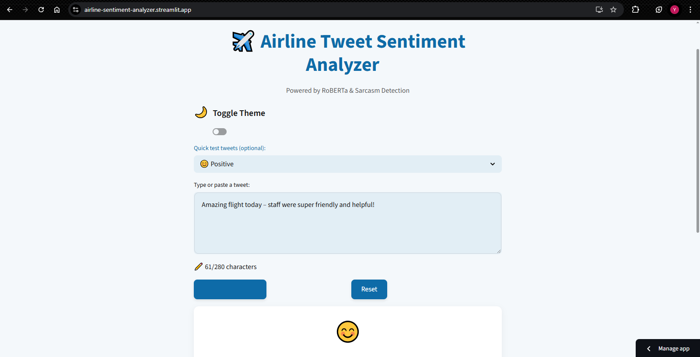
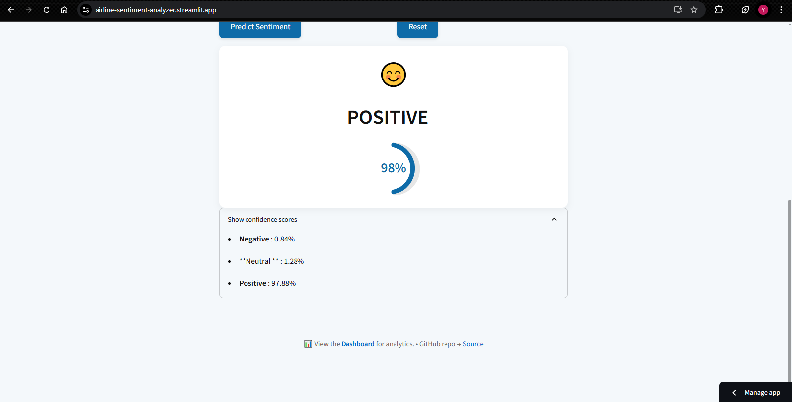
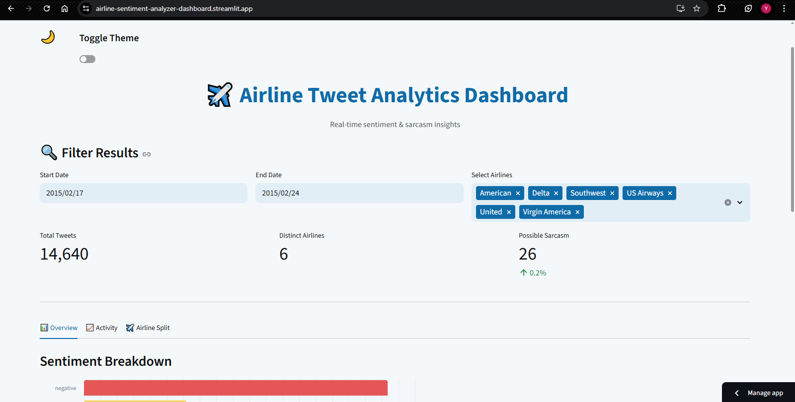
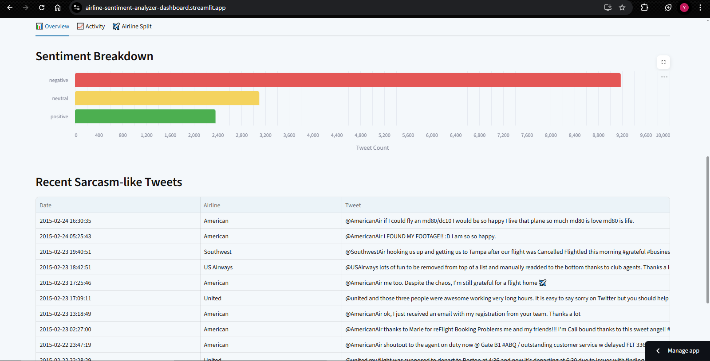

# ✈️ Airline Tweet Sentiment Analyzer


A real-time sentiment analyzer that classifies tweets related to airline services as **Positive**, **Neutral**, or **Negative**, with an integrated **sarcasm detector** to flag misleading emotional tone. Built using **RoBERTa models**, **Streamlit**, and **Transformers**.

---

## 🎯 Features

- 🔍 **Sentiment Classification** (RoBERTa)
- 😏 **Sarcasm Detection** (Hybrid rule-based + model-based)
- 🎨 Clean, responsive Streamlit interface
- 📊 Real-time confidence scores with warnings for low certainty
- 📝 CSV logging of predictions
- 📈 Optional analytics dashboard (sentiment trends, sarcasm stats)
- ☁️ Deployable on Streamlit Cloud or Render

---

## 🖼️ Demo

  
Try it live: [https://airline-sentiment-analyzer.streamlit.app](https://airline-sentiment-analyzer.streamlit.app/)

<p align="center">
  
  &nbsp;
  
</p>

---

## 📊 Dashboard

Check out the live analytics dashboard:

👉 [View Dashboard](https://airline-sentiment-analyzer-dashboard.streamlit.app/)

<p align="center">
  
  &nbsp;
  
</p>


This includes:
- Sentiment distribution
- Sarcasm detection
- Tweet activity over time


---

## 📁 Project Structure

```

sentiment-tweets/
├── src/
│   ├── app.py           # Main Streamlit UI
│   └── dashboard.py     # Optional analytics dashboard
├── models/              # (Optional) Trained pipeline files
├── data/
│   ├── Tweets.csv
│   └── cleaned_tweets.csv          
├── logs/
│   └── predictions.csv  # Auto-generated logs
├── .streamlit/
│   └── config.toml      # Custom UI config (optional)
├── requirements.txt     # All dependencies
└── README.md            # You're here

````

---

## 🚀 Getting Started

### 🔧 1. Clone the Repo
```bash
git clone https://github.com/YazhiniVenkatesan12/airline-sentiment-analyzer.git
cd sentiment-tweets
````

### 📦 2. Install Dependencies

```bash
pip install -r requirements.txt
```

### ▶️ 3. Run the App

```bash
streamlit run src/app.py
```

The app will open at `http://localhost:8501/`.

---

## 💡 Example Tweets to Try

| Type         | Example Tweet                                                                           |
| ------------ | --------------------------------------------------------------------------------------- |
| Positive     | `Amazing flight today – staff were super friendly and helpful!`                         |
| Neutral      | `My flight departs from gate B12 at 5:20 PM.`                                           |
| Negative     | `Flight delayed for 5 hours with zero explanation. Unacceptable!`                       |
| Sarcastic 🙃 | `So grateful my flight was cancelled and I got to spend 8 hours on an airport bench 🙃` |

---

## 🌐 Deployment

### ✅ Streamlit Cloud

1. Push to GitHub
2. Visit [streamlit.io/cloud](https://streamlit.io/cloud)
3. Deploy your app with entry point: `src/app.py`

### ✅ Render (Alternative)

1. Create a new web service
2. Set build command:

   ```bash
   pip install -r requirements.txt
   ```
3. Start command:

   ```bash
   streamlit run src/app.py --server.port=10000
   ```
---

## 🤖 Models Used

* [`cardiffnlp/twitter-roberta-base-sentiment-latest`](https://huggingface.co/cardiffnlp/twitter-roberta-base-sentiment-latest)
* [`cardiffnlp/twitter-roberta-base-irony`](https://huggingface.co/cardiffnlp/twitter-roberta-base-irony)

---

## 🙌 Acknowledgements

* Hugging Face Transformers
* Cardiff NLP Research Group
* Streamlit.io

```


